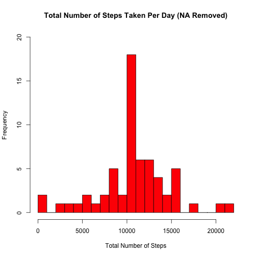

## Loading and preprocessing the data
This assignment makes use of data from a personal activity monitoring device. This device collects data at 5 minute intervals through out the day. The data consists of two months of data from an anonymous individual collected during the months of October and November, 2012 and include the number of steps taken in 5 minute intervals each day.

The data for this assignment [52K] can be downloaded from [the repository containing this markdown](https://github.com/adamdobrin/RepData_PeerAssessment1/blob/master/activity.zip?raw=) or [the course web site](https://d396qusza40orc.cloudfront.net/repdata%2Fdata%2Factivity.zip).

The variables included in this dataset are:
* steps: Number of steps taking in a 5-minute interval (missing values are coded as NA)
* date: The date on which the measurement was taken in YYYY-MM-DD format
* interval: Identifier for the 5-minute interval in which measurement was taken

The dataset is stored in a comma-separated-value (CSV) file and contains a total of 17,568 observations.

#### Load the data

```r
  data <- read.csv("activity.csv")
```

## Calculate the mean total number of steps taken per day
For this part of the assignment, we ignore the missing values in the dataset.

#### Calculate the total number of steps taken per day

```r
  stepsPerDayTotal <- aggregate(steps ~ date, data, sum)
```

#### Create a histogram of the total number of steps taken per day

```r
  hist(stepsPerDayTotal$steps, 
       breaks = 20, 
       main = 'Total Number of Steps Taken Per Day', 
       xlab = 'Total Number of Steps', 
       col = 'red')
```

 

#### Calculate and report the mean and median of the total number of steps taken per day

```r
  mean(stepsPerDayTotal$steps, na.rm = TRUE)
```

```
## [1] 10766.19
```

```r
  median(stepsPerDayTotal$steps, na.rm = TRUE)
```

```
## [1] 10765
```

## Find the average daily activity pattern

First, compute the total steps per interval and the total number of dates on which data was collected:


```r
  stepsPerIntervalMean <- aggregate(steps ~ interval, data, mean)
```

Note that data is missing for full days (_i.e._, there are no days for which there is step count data in some intervals and NA in others).

#### Create a time series plot of the 5-minute interval and the average number of steps taken, averaged across all days

```r
  plot(stepsPerIntervalMean$interval,
       stepsPerIntervalMean$steps,
       type = 'l',
       main = 'Average Steps by 5-Minute Time Interval',
       xlab = '5-Minute Time Interval',
       ylab = 'Average Number of Steps',
       col = 'blue'
       )
```

 

#### Calculate which 5-minute interval, on average across all the days in the dataset, contains the maximum number of steps

```r
  stepsPerIntervalMean$interval[which.max(stepsPerIntervalMean$steps)]
```

```
## [1] 835
```

## Imputing missing values
Note that there are a number of days/intervals where there are missing values (coded as NA). The presence of missing days may introduce bias into some calculations or summaries of the data.

#### Calculate and report the total number of missing values in the dataset (i.e. the total number of rows with NAs)

```r
  sum(is.na(data$steps))
```

```
## [1] 2304
```

#### Devise a strategy for filling in all of the missing values in the dataset
Since the precision is to the 5-minute interval, missing values in the dataset will be filled with the average number of steps taken per 5-minute interval, averaged across all days.

#### Create a new dataset that is equal to the original dataset but with the missing data filled in.

```r
  dataNoNA <- transform(data, 
                        steps = ifelse(is.na(data$steps), 
                                       stepsPerIntervalMean$steps[match(data$interval, stepsPerIntervalMean$interval)], 
                                       data$steps
                        )
  )
```

#### Create a histogram of the total number of steps taken each day
As before, after calculating the total number of steps taken per day from data with NA removed

```r
  stepsPerDayTotalNoNA <- aggregate(steps ~ date, dataNoNA, sum)
```

then create the histogram:


```r
  hist(stepsPerDayTotalNoNA$steps, 
       breaks = 20, 
       main = 'Total Number of Steps Taken Per Day (NA Removed)', 
       xlab = 'Total Number of Steps', 
       col = 'red',
       ylim = c(0, 20)
       )
```

 

#### Calculate and report the mean and median total number of steps taken per day

```r
  mean(stepsPerDayTotalNoNA$steps, na.rm = TRUE)
```

```
## [1] 10766.19
```

```r
  median(stepsPerDayTotalNoNA$steps, na.rm = TRUE)
```

```
## [1] 10766.19
```

#### Do these values differ from the estimates from the first part of the assignment?
Yes. See above.

#### What is the impact of imputing missing data on the estimates of the total daily number of steps?
After imputing missing data based on means, the median is now equal to the mean, implying more symmetrical data.

## Are there differences in activity patterns between weekdays and weekends?
To answer this, do the following:

#### Create a new dataset with a day type field to indicate weekday or weekend 

```r
  dataPlusDayType <- data
  dataPlusDayType$daytype <- ifelse(weekdays(as.Date(data$date)) %in% c("Saturday", "Sunday"), "Weekend", "Weekday")
```

#### Calculate the mean number of steps taken per interval and day type (omitting NA)

```r
  stepsPerIntervalAndDayTypeMean <- aggregate(steps ~ interval + daytype, dataPlusDayType, mean)
```

#### Load the lattice library and make time series plots, per type of day, of the 5-minute interval and the average number of steps taken, averaged across all days

```r
  library(lattice)
  xyplot(stepsPerIntervalAndDayTypeMean$steps ~ stepsPerIntervalAndDayTypeMean$interval|stepsPerIntervalAndDayTypeMean$daytype,
         main="Average Steps Per Day Type by Interval",
         xlab="5-Minute Time Interval", 
         ylab="Average Number of Steps",
         layout=c(1, 2), 
         type="l")
```

 

#### So, are there differences in activity patterns between weekdays and weekends?
Yes. On average, activity peaks in the morning on weekdays and does not return to even half of that level for the rest of the day, while activity reaches relatively similar peaks throughout the day on weekends.
